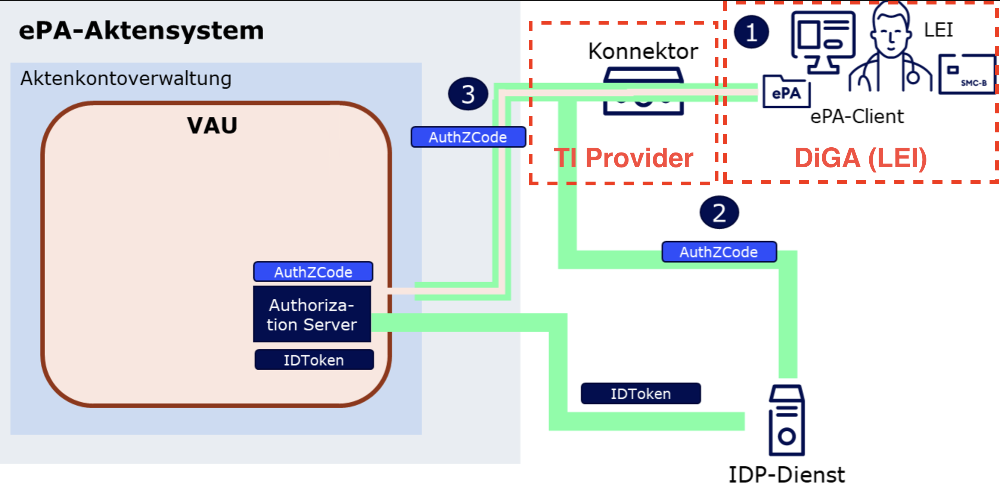

[](https://sonarcloud.io/summary/new_code?id=oviva-ag_epa4all-client)
[](https://central.sonatype.com/artifact/com.oviva.telematik/epa4all-client)

## epa4all-client - the document client for ePA 3.0
__[Example Usage](https://github.com/oviva-ag/epa4all-client/blob/main/epa4all-client/src/test/java/com/oviva/telematik/epa4all/client/internal/E2eEpa4AllClientImplTest.java#L26-L46)__

```java
try (var cf =
    Epa4AllClientFactoryBuilder.newBuilder()
        .konnektorProxyAddress(
            new InetSocketAddress(KONNEKTOR_PROXY_HOST, KONNEKTOR_PROXY_PORT))
        .konnektorService(TestKonnektors.riseKonnektor_RU())
        .environment(Environment.RU)
        .build()) {

  final var insurantId = "X11...";

  var client = cf.newClient();

  var document = ExportFixture.buildFhirDocument(client.authorInstitution(), insurantId);
  assertDoesNotThrow(() -> client.writeDocument(insurantId, document));
}
```

__[Maven Dependency](https://central.sonatype.com/artifact/com.oviva.telematik/epa4all-client)__

```xml
<dependency>
    <groupId>com.oviva.telematik</groupId>
    <artifactId>epa4all-client</artifactId>
    <version>0.0.2-rc.0</version>
</dependency>
```

## epa4all-rest-service

A thin adapter of a REST api to the client can be found at [epa4all-rest-service](./epa4all-rest-service).

In very short:
```shell
docker run --rm \
  -e 'EPA4ALL_KONNEKTOR_URI=https://10.156.145.103:443' \
  -e 'EPA4ALL_PROXY_ADDRESS=host.docker.internal' \
  -e 'EPA4ALL_CREDENTIALS_PATH=/credentials.p12' \
  -e 'EPA4ALL_ENVIRONMENT=RU' \
  -v './credentials.p12:/credentials.p12' \
  -p '127.0.0.1:8080:8080' \
  ghcr.io/oviva-ag/epa4all-rest-service:latest
```

### docker-compose with userspace wireguard
This would be an example on how to run the epa4all-rest-service with a VPN connection to the Konnektor. The VPN connection is established via a userspace wireguard implementation. The service uses the network stack of the VPN container.

Note: a userspace wireguard implementation is not as performant as a kernel implementation. If you want to use a kernel implementation, you need to run the VPN container in host network mode.
```yaml
services:
  epa4all-rest:
    container_name: epa4all-rest
    image: epa4all-rest-service:latest
    ports:
        - '127.0.0.1:8099:8080'
    volumes:
        - ./vKon_Client_XXX.p12:/credentials.p12
    environment:
        - EPA4ALL_KONNEKTOR_URI=https://10.156.145.103:443
        - EPA4ALL_ENVIRONMENT=RU
        - EPA4ALL_PROXY_ADDRESS=127.0.0.1
        - EPA4ALL_KONNEKTOR_PROXY=false
        - EPA4ALL_CREDENTIALS_PATH=/credentials.p12

        - EPA4ALL_WORKPLACE_ID=test-arbeitsplatz
        - EPA4ALL_CLIENT_SYSTEM_ID=test-api
        - EPA4ALL_MANDANT_ID=test-mandant
        - EPA4ALL_USER_ID=admin

  epa4all-vpn:
    container_name: epa4all-vpn
    image: qmcgaw/gluetun:v3
    cap_add:
        - NET_ADMIN
    network_mode: "service:epa4all-rest"
    environment:
        - VPN_SERVICE_PROVIDER=custom
        - VPN_TYPE=wireguard
        - WIREGUARD_IMPLEMENTATION=userspace
        - DNS_KEEP_NAMESERVER=on
        - PUBLICIP_ENABLED=off

        - HEALTH_TARGET_ADDRESS=10.156.145.103:443
        - HEALTH_VPN_DURATION_INITIAL=24h
        - HEALTH_VPN_DURATION_ADDITION=24h
        - HEALTH_SUCCESS_WAIT_DURATION=24h
    volumes:
        - ./VPN_Configuration_XXX.conf:/gluetun/wireguard/wg0.conf
    healthcheck:
        test: "ping -c 1 10.156.145.103:443 || exit 1"
        interval: 1s
        retries: 1
        timeout: 5s
        start_period: 5s
```

## Cloud-Based Infrastructure Setup

- client traffic routed via HTTP forward proxy into the telematik infrastructure - applications and developers go via
  proxy
- card terminal hosted separately, e.g. in a self-hosted datacenter (or closet)
- Konnektor etc. can be provisioned from an enabler such as RISE


# Architectural Overview



## References

- [TI Leitfaden for DiGAs](https://wiki.gematik.de/pages/viewpage.action?pageId=512716463)
- [GemSpec Trusted-Environment Authorization, chapter 3.3](https://gemspec.gematik.de/docs/gemILF/gemILF_PS_ePA/gemILF_PS_ePA_V3.2.3/#3.3)
- [Gematik OpenAPI Spec I_Authorization_Service](https://github.com/gematik/ePA-Basic/blob/ePA-3.0.3/src/openapi/I_Authorization_Service.yaml)
- [Authorization Code: Structure](https://gemspec.gematik.de/docs/gemSpec/gemSpec_IDP_Dienst/gemSpec_IDP_Dienst_V1.7.0/#7.3)

## Glossary

- **LEI** - Service Provider (Leistungs Institution)
- **TI** - Telematik Infrastruktur

## Overview

from [ILF PS ePA4all](https://gemspec.gematik.de/docs/gemILF/gemILF_PS_ePA/gemILF_PS_ePA_V3.2.3/#3.3.2)
